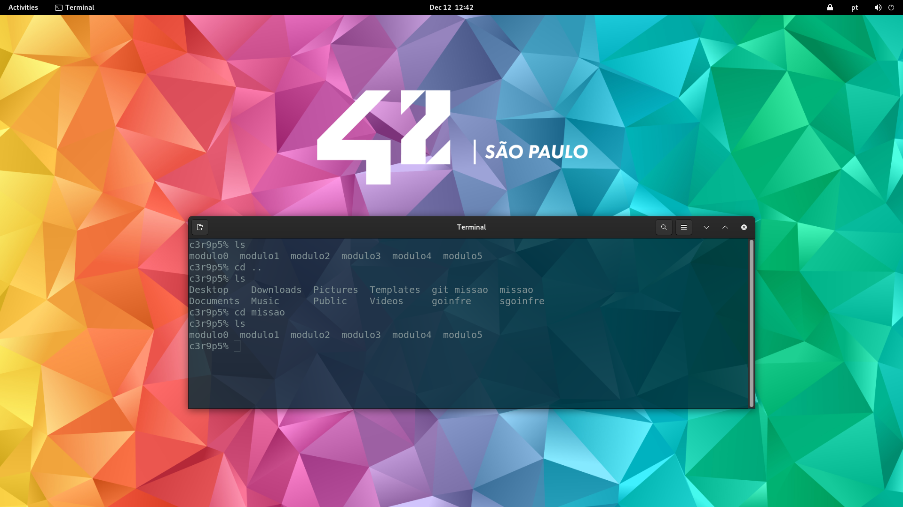

# 🐍 Missão Python — Escola 42 São Paulo

Missão em Python foi uma imersão presencial de 5 dias na Escola 42 São Paulo, criada com o propósito de aprender a aprender e compartilhar conhecimento entre todos.  
Uma experiência extraordinária que mostrou na prática a força do método inovador dessa instituição incrível.

---

## 📂 Estrutura do Repositório
Este repositório contém os módulos desenvolvidos durante a imersão:

- módulo0  
- módulo1  
- módulo2  
- módulo3  
- módulo4  
- módulo5
- modulo6
- modulo7
- modulo8
- modulo9

  ---

## 🚀 Objetivo da Imersão
- Desenvolver autonomia para aprender programação.  
- Resolver problemas de forma colaborativa.  
- Compartilhar conhecimento entre colegas.  
- Experimentar o método pedagógico único da 42.

---

## 🧠 Tecnologias e Ferramentas
- Python  
- Terminal / Shell  
- Git & GitHub  
- Ambiente 42 São Paulo  

---

## 🙌 Agradecimentos
A todos da 42 São Paulo pela experiência incrível e pela metodologia que incentiva a criatividade, colaboração e aprendizagem contínua.

  

